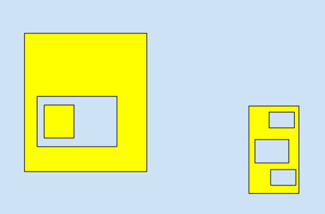

# Sea_and_Land
A simple code challenge to test our SW Engineering experience :)

Problem

You are given a list of two-dimensional axis-aligned rectangular boxes that are either contained
within or disjoint from (non-overlapping with) one another. They therefore partition the plane into a number of regions. The unbounded region, which lies outside all of the boxes, is classified as
“sea”. All other regions are classified either as “sea” or as “land”, subject to the constraint that no two regions that share a boundary may share the same classification. The task is to output the
number of regions classified as “land”.

Blue = sea, Yellow = land.

You can expect each box to be defined in terms of the Cartesian coordinates of its minimum
corner {a, b} and its maximum corner {c, d} such that a < c and b < d. If you make any other
assumptions as part of your solution then please make comments in the code. If there are further considerations that might affect the memory use or performance of your solution then do make a note of them.

Submission
When submitting your solution please return all of your code, including any tests that you might have written and any documentation that you feel is appropriate. Please archive your solution
either as a .tar or .zip file.

Sample Input Some sample data is provided below for you to use when testing your solution. The first line
contains an integer n denoting the number of boxes. The next n lines contain the four floating
point values a, b, c, d that define Cartesian coordinates of the minimum corner and maximum
corner of each box separated by a single space. Note that this input does not correspond to the above diagram.

|14|
1.0 1.0 10.0 6.0   
1.5 1.5 6.0 5.0  
2.0 2.0 3.0 3.0  
2.0 3.5 3.0 4.5  
3.5 2.0 5.5 4.5  
4.0 3.5 5.0 4.0  
4.0 2.5 5.0 3.0  
7.0 3.0 9.5 5.5  
7.5 4.0 8.0 5.0  
8.5 3.5 9.0 4.5  
3.0 7.0 8.0 10.0  
5.0 7.5 7.5 9.5  
5.5 8.0 6.0 9.0  
6.5 8.0 7.0 9.0 

Sample Output:

9
